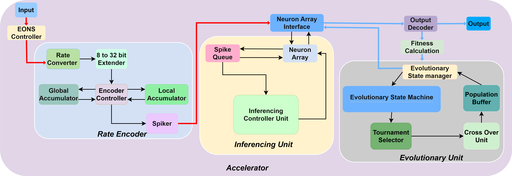
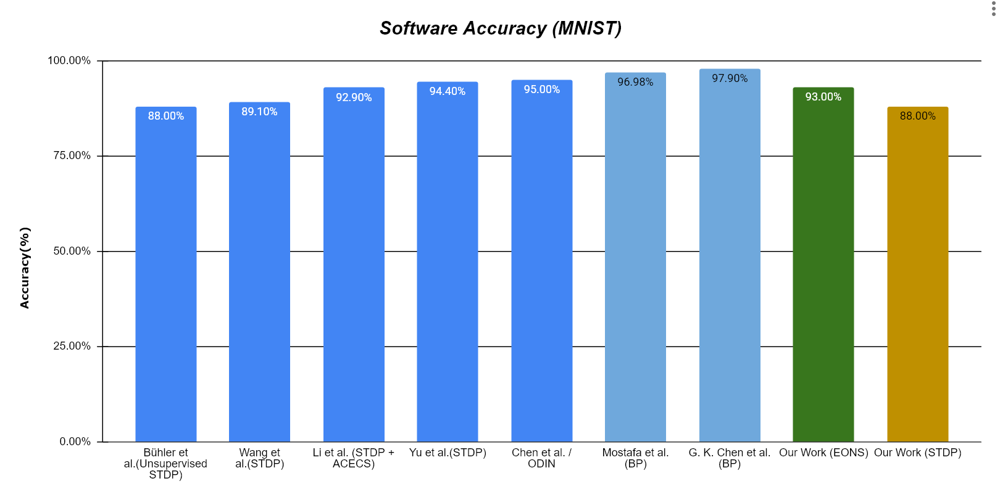
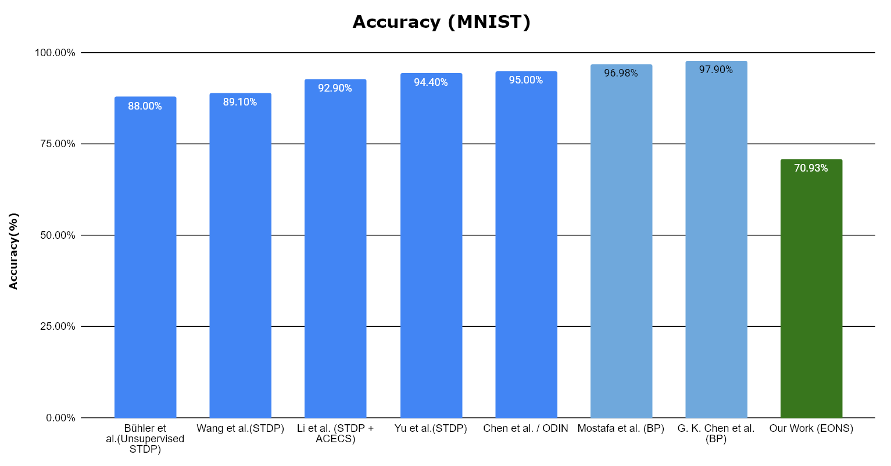

# On-Chip Online Learning For Neuromorphic Hardware

#### Team
- e20034, Bandara G.M.M.R., [email](mailto:e20034@eng.pdn.ac.lk)
- e20280, Pathirage R.S., [email](mailto:e20280@eng.pdn.ac.lk)
- e20385, Sriyarathna D.H., [email](mailto:e20385@eng.pdn.ac.lk)

#### Supervisors
- Prof.Roshan G. Ragel, [email](mailto:roshanr@eng.pdn.ac.lk)
- Dr.Isuru Nawinne, [email](mailto:isurunawinne@eng.pdn.ac.lk)

#### Table of Contents
1. [Abstract](#abstract)
2. [Related Works](#related-works)
3. [Methodology](#methodology)
4. [Experiment Setup and Implementation](#experiment-setup-and-implementation)
5. [Results and Analysis](#results-and-analysis)
6. [Conclusion](#conclusion)
7. [Publications](#publications)
8. [Links](#links)

---

## Abstract

Conventional Deep Neural Networks (DNNs) face significant energy and latency challenges on edge devices due to dense matrix multiplications and catastrophic forgetting. While Spiking Neural Networks (SNNs) and local learning rules like Spike-Timing-Dependent Plasticity (STDP) offer energy-efficient alternatives, they are fundamentally limited by a persistent accuracy plateau. This project presents a Hardware-Software (HW/SW) co-design accelerator that utilizes Evolutionary Optimization for Neuromorphic Systems (EONS) to overcome these limitations. The architecture partitions high-throughput neural data paths into Register-Transfer Level (RTL) hardware while offloading complex genetic operations (like fitness calculation and crossover) to software. Software simulations show that EONS surpasses the STDP bottleneck, achieving 95% accuracy compared to the STDP baseline of 87%. Although cycle-accurate hardware co-simulations achieved a lower 71% accuracy due to bit-width quantization, this work provides a successful functional proof-of-concept for gradient-free, on-chip online learning in power-constrained embedded systems.

## Related Works

Spiking Neural Networks (SNNs) have become highly attractive for processing sensory information on resource-constrained edge platforms due to their event-driven, low-power paradigm. However, traditional on-chip unsupervised learning rules like STDP face a performance bottleneck, typically hitting an accuracy ceiling of 90% to 95% on benchmarks like MNIST. To overcome this, recent non-STDP accelerators rely on global gradient-based backpropagation (BPTT), which can achieve over 99% accuracy but consumes prohibitive amounts of power (~14W to >20W), violating strict edge constraints. The EONS framework provides a highly flexible, gradient-free alternative by treating network training as an evolutionary search problem. Because it does not rely on backward error propagation, EONS natively accounts for physical hardware constraints while producing compact, highly accurate spiking networks.

## Methodology

The system operates using a Hardware-Software (HW/SW) co-design architecture to prevent overpopulating the silicon area with complex, non-critical control components. Computationally heavy genetic operations—such as fitness calculation, tournament selection, and cross-over—are partitioned into software. 

Conversely, the high-throughput, event-driven data paths are implemented strictly in hardware. The hardware accelerator utilizes a Leaky Integrate-and-Fire (LIF) neuron model and consists of a Rate Encoder to convert real-valued inputs into spike trains, an Inference Unit (featuring a Network-on-Chip and banked neuron arrays), and an Evolutionary State Manager to handle the learning loops. 

**High-Level Design Diagram**

*Figure 1: High-level architecture of the on-chip online learning neuromorphic accelerator.*

## Experiment Setup and Implementation

To evaluate the partitioned EONS architecture, a comprehensive hardware-software co-simulation methodology was established. Verilator was utilized to perform cycle-accurate co-simulations. The core event-driven components were implemented at the Register-Transfer Level (RTL) and seamlessly interfaced with the software-designated evolutionary components written natively in C++. 

The accelerator was benchmarked using the standard MNIST handwritten digit dataset using a rate-coding scheme. To calculate fitness efficiently, the C++ Inference Controller dynamically samples a representative subset (10%) of the total dataset for manual testing. Over a defined number of generations, the C++ Cross-Over unit generates new network parameters that are continually written back to the hardware Neuron Arrays.

**Accelerator Design Diagram**

*Figure 2: Detailed microarchitecture of the neuromorphic hardware accelerator.*

## Results and Analysis

The system was evaluated primarily on **classification accuracy** to determine its viability for resource-constrained edge systems. 

In initial software-only algorithmic simulations, the dynamically evolved EONS network bypassed the traditional STDP performance ceiling, achieving a superior classification accuracy of 95% (compared to the 87.4% baseline of trace-based STDP). However, during the cycle-accurate Verilator co-simulation of the RTL implementation, the HW/SW architecture achieved a peak accuracy of 71%. This accuracy drop is attributed to strict bit-width quantization (specifically within the 8-to-32 bit extender), limited accumulator resolution, and precision loss when truncating weights generated by the software crossover unit. 

**Accuracy Results**

*Figure 3: Software accuracy comparison against existing systems.*

*Figure 4: Hardware accuracy comparison against existing systems.*

## Conclusion

This project successfully validates a hardware-software co-simulation architecture designed to execute Evolutionary Optimization for Neuromorphic Systems (EONS) at the edge. By partitioning event-driven neural datapaths into RTL hardware and complex genetic operations into software, the system demonstrates the functional viability of gradient-free, on-chip learning. While the architecture establishes a scalable framework for Neuromorphic Continual Learning (NCL), classification accuracy plateaued at 71% due to physical hardware bottlenecks such as low-bitwidth fixed-point precision and rate coding limitations. Future iterations will aim to resolve these bottlenecks by exploring advanced multi-point crossover algorithms and high-density temporal coding schemes, such as Time-to-First-Spike (TTFS).

## Publications

[//]: # "Note: Uncomment each once you uploaded the files to the repository"

<!-- 1. [Semester 7 report](./) -->
<!-- 2. [Semester 7 slides](./) -->
<!-- 3. [Semester 8 report](./) -->
<!-- 4. [Semester 8 slides](./) -->
<!-- 5. Author 1, Author 2 and Author 3 "Research paper title" (2021). [PDF](./). -->

## Links

- [Project Repository](https://github.com/cepdnaclk/e20-4yp-On-Chip-Online-Learning-For-Neuromorphic-Hardware)
- [Project Page](https://cepdnaclk.github.io/e20-4yp-On-Chip-Online-Learning-For-Neuromorphic-Hardware)
- [Department of Computer Engineering](http://www.ce.pdn.ac.lk/)
- [University of Peradeniya](https://eng.pdn.ac.lk/)

[//]: # "Please refer this to learn more about Markdown syntax"
[//]: # "https://github.com/adam-p/markdown-here/wiki/Markdown-Cheatsheet"
