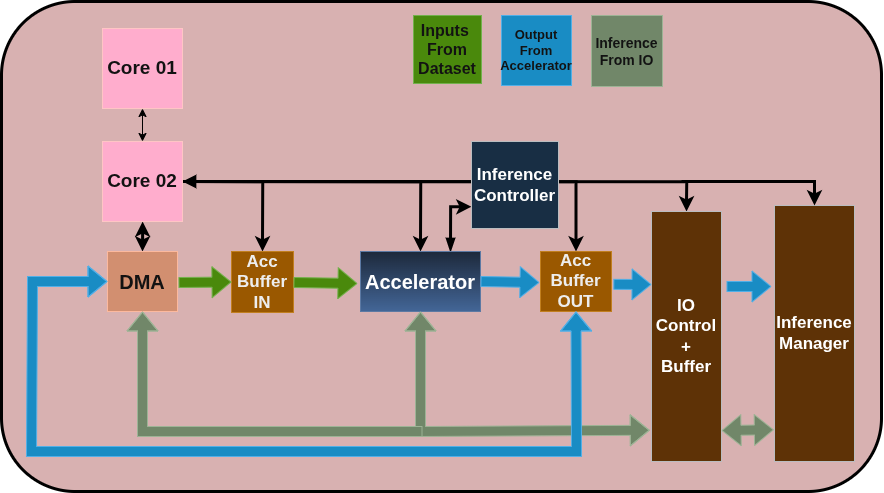
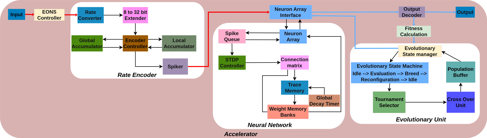
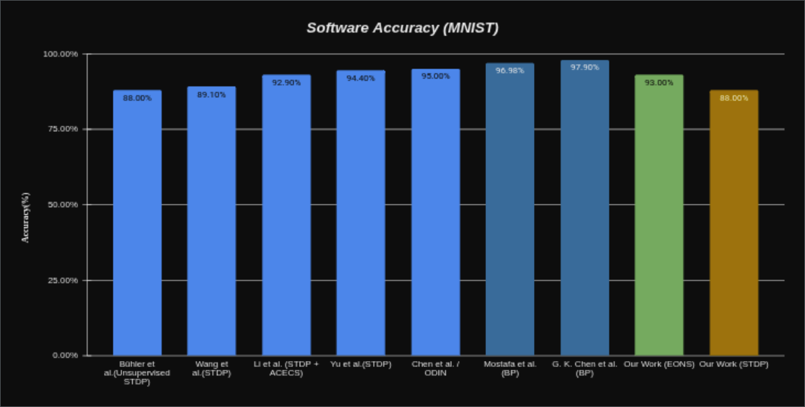

# On-Chip Online Learning For Neuromorphic Hardware

#### Team
- e20034, Bandara G.M.M.R., [email](mailto:e20034@eng.pdn.ac.lk)
- e20280, Pathirage R.S., [email](mailto:e20280@eng.pdn.ac.lk)
- e20385, Sriyarathna D.H., [email](mailto:e20385@eng.pdn.ac.lk)

#### Supervisors
- Prof.Roshan G. Ragel, [email](mailto:roshanr@eng.pdn.ac.lk)
- Dr.Isuru Nawinne, [email](mailto:isurunawinne@eng.pdn.ac.lk)

#### Table of Contents
1. [Abstract](#abstract)
2. [Related Works](#related-works)
3. [Methodology](#methodology)
4. [Experiment Setup and Implementation](#experiment-setup-and-implementation)
5. [Results and Analysis](#results-and-analysis)
6. [Conclusion](#conclusion)
7. [Publications](#publications)
8. [Links](#links)

---

## Abstract

Neuromorphic computing offers a promising paradigm for energy-efficient, brain-inspired information processing. This project focuses on the design and implementation of an on-chip online learning accelerator targeting neuromorphic hardware. The accelerator is built around a Spiking Neural Network (SNN) architecture, incorporating Spike-Timing-Dependent Plasticity (STDP) as the on-chip learning mechanism. A hardware implementation of the Evolutionary Optimized Neuromorphic System (EONS) is also explored, where STDP-based synaptic adaptation is employed to enhance system robustness. The design is realized using Verilog RTL description, with C++ simulations used for preliminary functional and performance validation. Accuracy and latency serve as the primary evaluation metrics for assessing system performance.

## Related Works

Spiking Neural Networks have been studied extensively as biologically plausible models for computation. Prior work such as Diehl & Cook (2015) demonstrated competitive classification accuracy using STDP-based unsupervised learning on the MNIST dataset. Neuromorphic platforms such as Intel's Loihi and IBM's TrueNorth have shown the feasibility of on-chip learning in dedicated hardware. The EONS framework builds upon evolutionary strategies to optimize network topology and synaptic parameters for improved generalization. This project draws from these foundations to design a hardware accelerator that supports online learning directly on chip, targeting both accuracy improvement and low-latency inference.

## Methodology

The system is designed around a pipelined SNN accelerator that supports online weight updates via a trace-based STDP learning rule. The high-level architecture partitions the design into a neuron processing core, a synaptic weight memory subsystem, and a learning controller. Spike-timing traces for both pre- and post-synaptic neurons are maintained on-chip to compute Long-Term Potentiation (LTP) and Long-Term Depression (LTD) updates in real time.

For the EONS hardware implementation, the network topology and initial weight configuration produced by the evolutionary optimization process are mapped onto the hardware architecture. STDP is then applied during operation to allow the system to adapt and maintain robustness under varying input conditions.

**High-Level Design Diagram**

*Figure 1: High-level architecture of the on-chip online learning neuromorphic accelerator.*

## Experiment Setup and Implementation

The accelerator is described in Verilog and targeted for FPGA implementation. C++ simulations are used in the preliminary stages to validate the SNN dynamics, encoding schemes, and STDP weight update behaviour before hardware synthesis. The test environment uses standard benchmark datasets to evaluate classification performance.

Key implementation parameters include:
- **Encoding:** Rate and temporal spike encoding schemes
- **Weight representation:** 8-bit integer weights with 16-bit accumulators
- **Learning rule:** Trace-based STDP with configurable LTP/LTD time constants
- **Memory:** Dual-port SRAM organisation for concurrent synaptic read/write access

**Accelerator Design Diagram**

*Figure 2: Detailed microarchitecture of the neuromorphic hardware accelerator.*

## Results and Analysis

The system is evaluated using **accuracy** and **latency** as primary performance metrics. Results from both C++ simulation and hardware implementation are presented below.

**Accuracy Results**

*Figure 3: Classification accuracy across training epochs.*

*Figure 4: Accuracy comparison across encoding schemes.*

*Figure 5: Accuracy vs. latency trade-off analysis.*

## Conclusion

This project presents the design of an on-chip online learning accelerator for neuromorphic hardware, integrating STDP-based synaptic plasticity to enable continuous adaptation without off-chip retraining. The hardware implementation of the EONS system, augmented with spike-timing-dependent learning, is aimed at improving classification robustness in resource-constrained environments. Verilog RTL design combined with C++ simulation provides a pathway from algorithmic validation to physical implementation. The work contributes toward making neuromorphic online learning practical for embedded and edge computing applications.

## Publications

[//]: # "Note: Uncomment each once you uploaded the files to the repository"

<!-- 1. [Semester 7 report](./) -->
<!-- 2. [Semester 7 slides](./) -->
<!-- 3. [Semester 8 report](./) -->
<!-- 4. [Semester 8 slides](./) -->
<!-- 5. Author 1, Author 2 and Author 3 "Research paper title" (2021). [PDF](./). -->

## Links

- [Project Repository](https://github.com/cepdnaclk/e20-4yp-On-Chip-Online-Learning-For-Neuromorphic-Hardware)
- [Project Page](https://cepdnaclk.github.io/e20-4yp-On-Chip-Online-Learning-For-Neuromorphic-Hardware)
- [Department of Computer Engineering](http://www.ce.pdn.ac.lk/)
- [University of Peradeniya](https://eng.pdn.ac.lk/)

[//]: # "Please refer this to learn more about Markdown syntax"
[//]: # "https://github.com/adam-p/markdown-here/wiki/Markdown-Cheatsheet"
